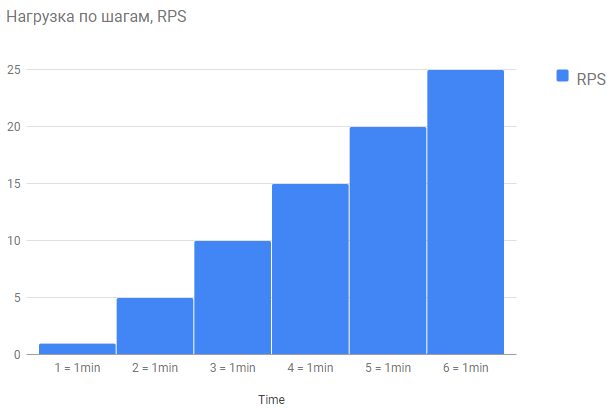
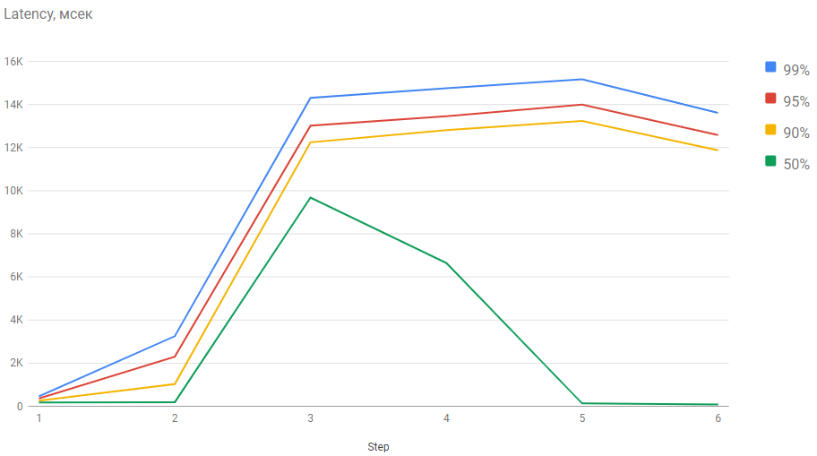
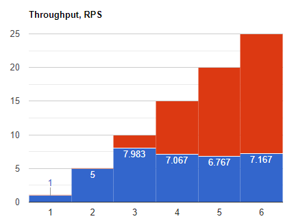
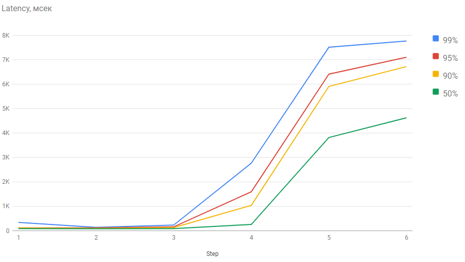
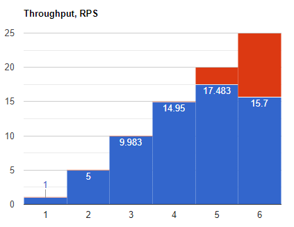
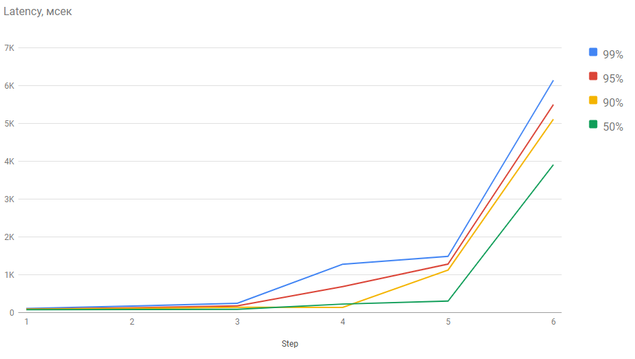
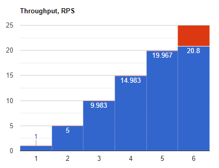
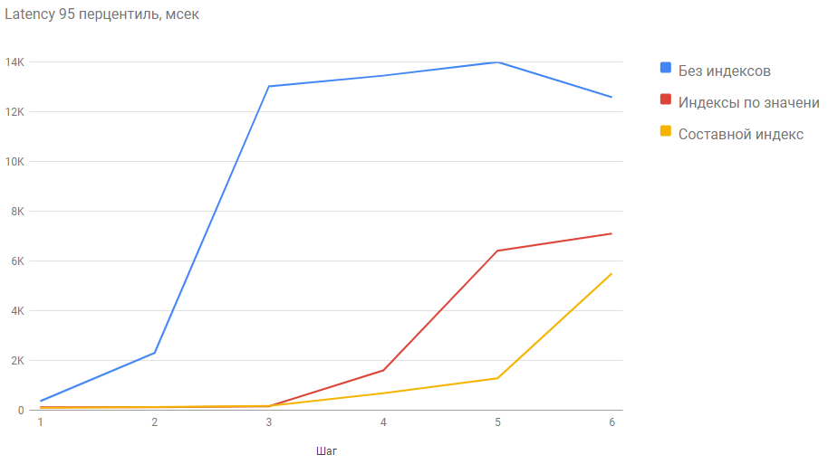
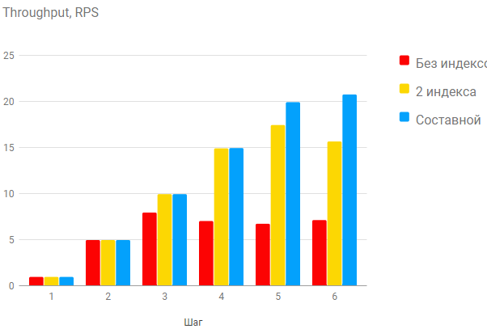

# Домашнее задание №2

### Генерация анкет

В базу добавлены 999931 записей из предложенного в задании файла. Загрузка была выполнена отдельным [скриптом](add_data.sql).
Для учебных целей поле "биография" не заполнено (NULL), в поле "пароль" для всех записей записана строка "pwd".

### Функционал поиска анкет по имени и фамилии

Добавлен новый метод GET /user/search. Поиск анкет по частичному одновременному совпадению начала имени и фамилии. Анкеты в ответе отсортированы по ID.
Запрос:
```
SELECT u.ID
	,u.FirstName
	,u.SecondName
	,u.BirthDate
	,COALESCE(u.Biography,'')
	,COALESCE(u.City,'')
FROM users u
WHERE FirstName LIKE '{{FirsName}}%' AND SecondName LIKE '{{SecondName}}%'
ORDER BY ID ASC
```
Внесены дополнения в [POSTMAN collection](OTUS-HighLoadArch.postman_collection.json)

### Тестирование

Тестируется нагрузка на метод посика анкет.
Гипотеза: при увеличении количества запросов пользователей растут задержки при получении информации и падает количество успешно выполненных запросов.
Два главных параметра для отслеживания:

- latency;
- throughput.

Дополнительно проверим допустимую нагрузку на сервис (количество пользователей).
Нагрузка моделируется с помощью jmeter. Сервис развернут в docker-контейнере.

При плавном увеличении нагрузки замечено, что latency и количество ошибок может быть с "провалами" или пропусками. Поэтому целесообразнее подавать постоянную нагрузку определенный период времени для более корректной оценки.

Выберем период времени: 1 минута. Будем увеличивать количество запросов, первый шаг 1 запрос/сек (1 RPS); второй - 5 RPS и далее увеличение с шагом 5 RPS.



Для тестов выберем значения для поиска 'Нико' 'Рябо' (8 результатов в ответе), значительного различия в latency и throughput для разных запросов не замечено.

После проведения теста построим график Latency по шагам в мсек для 99, 95, 90 и 50 процентилей.


Throughput в запросах в сек для каждого шага. Синим успешные запросы:


Прослеживается интересный эффект, что с ростом нагрузки часть запросов отклоняется и средний latency успешно выполненных запросов уменьшается, но процент успешно выполненных запросов падает.

### Выбор индекса

Из [документации Postgresql](https://www.postgresql.org/docs/current/indexes-types.html#INDEXES-TYPES-BTREE) следует, что для нашего случая необходимо выбрать индекс B-TREE и проиндексировать оба поля, по которым идет поиск. Т.е. у нас возможны 2 варианта - индексация по каждому полю отдельно или создание составного индекса.

### Индексация по полям отдельно

Запрос в БД:
```
CREATE INDEX fname2_idx ON users (firstname varchar_pattern_ops);
CREATE INDEX lname2_idx ON users (secondname varchar_pattern_ops);
```
Постоим такие же графики, как до индексации:





### Индексация по составному полю

Удалим индексы, созданные на прошлом шаге и добавим новый:
```
CREATE INDEX fname3_idx ON users (firstname varchar_pattern_ops, secondname varchar_pattern_ops);
```
После проеведения теста:





```
"Sort  (cost=911.92..911.92 rows=1 width=134) (actual time=8.228..8.233 rows=56 loops=1)"
"  Sort Key: id"
"  Sort Method: quicksort  Memory: 33kB"
"  ->  Index Scan using fname3_idx on users u  (cost=0.42..911.91 rows=1 width=134) (actual time=1.909..8.133 rows=56 loops=1)"
"        Index Cond: (((firstname)::text ~>=~ 'Ни'::text) AND ((firstname)::text ~<~ 'Нй'::text) AND ((secondname)::text ~>=~ 'Ря'::text) AND ((secondname)::text ~<~ 'Рѐ'::text))"
"        Filter: (((firstname)::text ~~ 'Ни%'::text) AND ((secondname)::text ~~ 'Ря%'::text))"
"Planning Time: 0.716 ms"
"Execution Time: 8.315 ms"
```


### Сравнение результатов

Построим сводный график latency, выберем для сравнения 95 перцетиль:


График сравнения для throughput:


### Вывод

Для случая, когда ведется поиск по части совпадения строки необходимо выбирать индексацию B-TREE.
Для случая, когда поиск ведется по двум полям одновременно рекомендуется использовать составной индекс по этим полям. Надо учесть, что в данном случае сортировка задана, при изменении сортировки в поиске есть риск, что созданный индекс работать не будет.
С помощью правильно подобранной индексации возможно в несколько раз увеличить пропускную способность работы сервиса при том же latency.