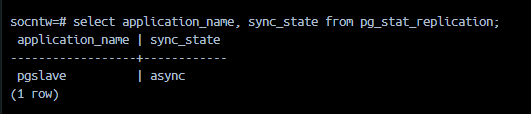
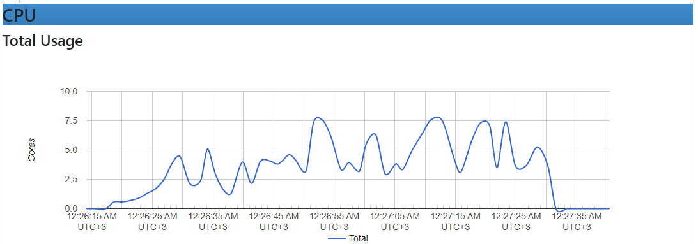
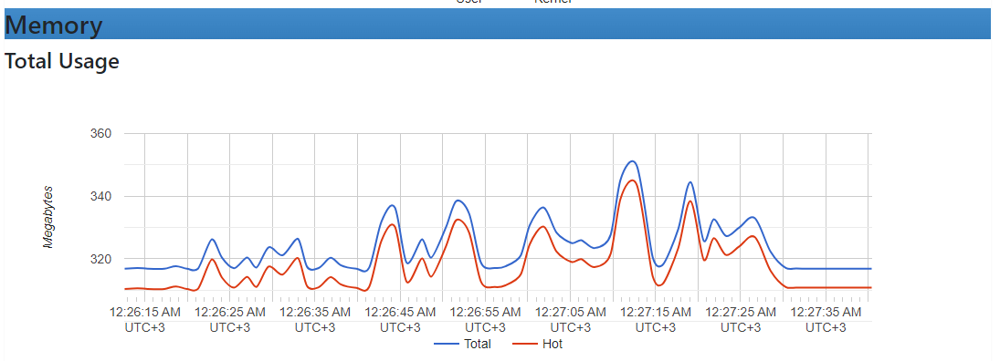
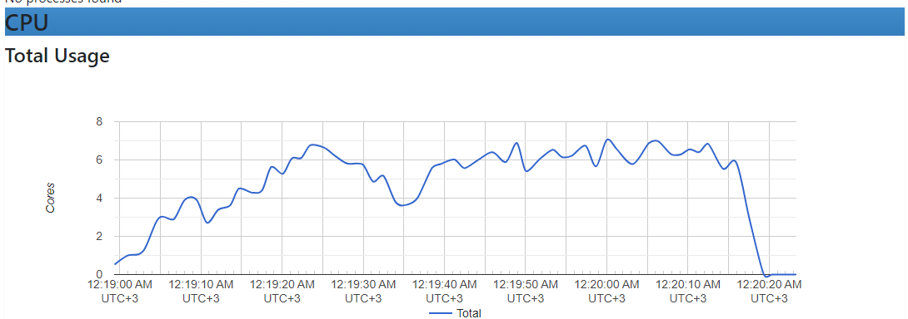
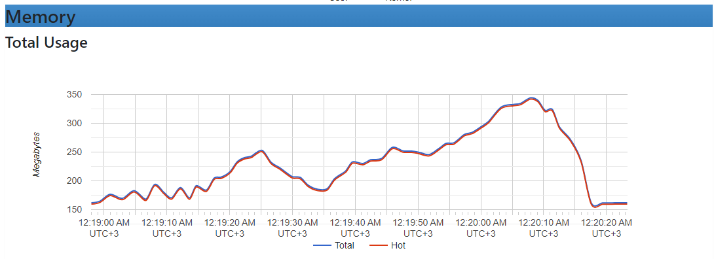
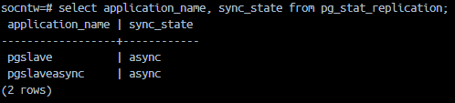
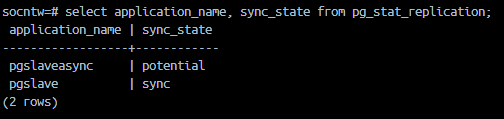
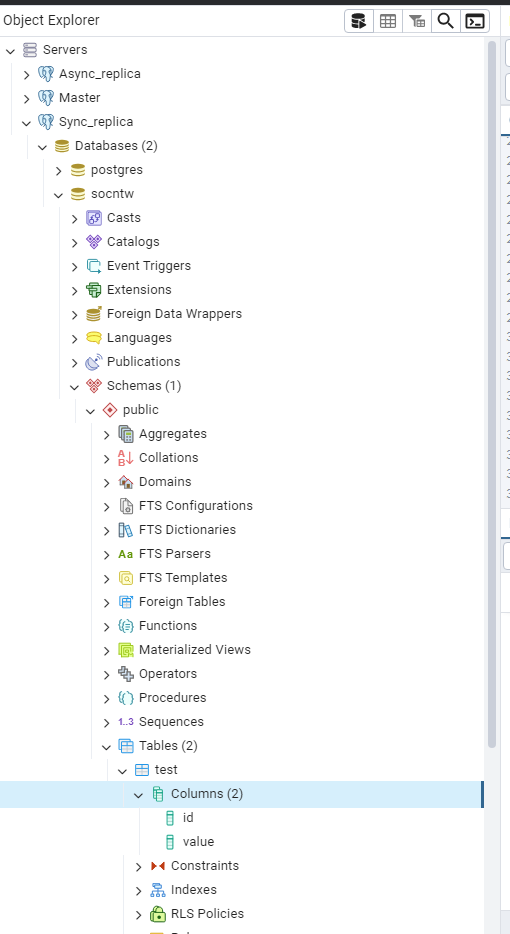
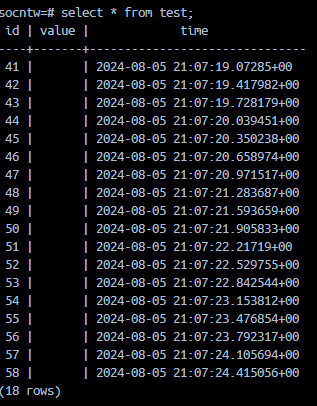

# Домашнее задание 3

## Подготовка

Тесты и репликация будет проводиться в контейнерах docker.
Мастер взят из предыдущего задания, реплики запускаются в отдельных контейнерах в одной сети с мастером.
Нагрузка моделируется скриптом на golang отправляющем с настраиваемой периодичностью запросы на запись.

## Часть I - Проведение репликации и проверка нагрузки на мастер и реплику

### Моделирование нагрузки на БД

Выберем средний уровень нагрузки для запросов на чтение.
`/user/get/{id}` и `/user/search`. Подберем высокую рабочую нагрузку и проведем тестирование.

По результатам предварительного тестирования нагрузки подобрана высокая нагрузка - . 
Интересно заметить, что при запуске несколько разных типов запросов одновременно latency и throughput не складываеются линейно, т.е. сложно точно спрогнозировать значния, зная lat и throughput от нагрузки каждого запроса отдельно.

Разгов в течение 15 сек с нуля до 4 запросов в сек для `/user/search` и 5 запросов в сек для `/user/get/{id}`. Нагрузка держится 1 минуту.


### Настройка асинхронной репликации

В мастере вносим изменения в postgresql.conf:
```
ssl = off
wal_level = replica
max_wal_senders = 4
```
```
create role replicator with login replication password 'pass';
```

```
host    replication     replicator       hla-hw1_default         md5
```

В той же сети создадим еще один контейнер pgslave

Создадим в pgres файл бэкапа и скопируем его в каталог созданного pgslave

создадим служебный файл:
`touch /var/lib/docker/volumes/pgslave/standby.signal`

Изменим файл postgresql.conf на реплике:
`primary_conninfo = 'host=pgres port=5432 user=replicator password=pass application_name=pgslave'`

Проверим, что реплика запустилась и рабоает в асинхронном режиме:


### Тестирование до и после репликации

Переключим сервис на чтение из реплики, для этого изменим настройки в сервисе.
Инетересно, что реплика справляется хуже, чем мастер. Но нагрузка на мастер практически отсутсвует. Вся нагрузка переходит на реплику.

Нагрузка при запросах на мастер:





При переносе чтения с мастера на реплику, нагрузка на мастер отсутствует. Есть только нагрузка на реплику. Приведем нанагрузку на ресурсы контейнера `pgslave`:




Сравнение:

| Нарузка при тестировании | 99% Line | 95% Line | 90% Line | Median | Throughput |
| ------------------------ | -------- | -------- | -------- | ------ | ---------- |
| Мастер без реплики       | 1624     | 983      | 662      | 180    |  8.36757      |
| Чтение с реплики         |  10847     | 9245      | 7149       |   3268     |    7.30639       |

Чтение с реплики во всех тестах показывает результаты хуже, чем чтение с мастера, особенно при нагрузках, близких к передельным.

## Часть II - Практика в настройке различных типов репликации и проверка возможных потерь при остановке мастера

### Запуск второй реплики, изменение типа репликации

Запустим вторую реплику с именем `pgslaveasync`, проверим, что обе реплики работают в асинхронном режиме:



Переведем первую реплику `pgslave` в синхронный режим. Внесем изменения в `postgresql.conf` на мастере:

```
synchronous_commit = on
synchronous_standby_names = 'FIRST 1 (pgslave, pgasyncslave)'
```

И перезапустим мастер:



### Проверка работы друх реплик. Нагрузка на запись

Для проверки работы создадим на мастере новую таблицу для тестов с названием test и через pgAdmin убедимся, что в репликах так же таблицы были созданы:



Для моделирования нагрузки создадим скрипт, создающий новую запись в таблице test с периодичностью 0.3 сек.

### Остановка реплики

Во время работы скрипта отключим мастер (остановим контейнер).

По логам работы скрипта контейнер был остановлен на 18 шаге, т.е. в таблицу мастера записалось 18 записей.

Проверим обе реплики - на них по 18 значений в таблице test:



Переведем реплику `pgslave` в мастер. Выполним на ней `SELECT pg_promote();`
Переключим `pgslaveasync` к `pglsqve` как реплику внеся изменения в `postgresql.conf` и перезапустим контейнер.


## Вывод

Протестирована работа асинхронной и кворумной репликации. При скорости отправки запросов на создание записи на мастер 0.3 в секунду при внезапной остановке мастера ни одна из записей потеряна не была. Все записи есть на репликах.
