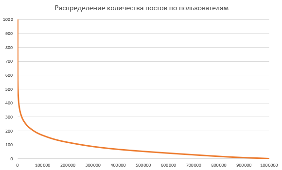
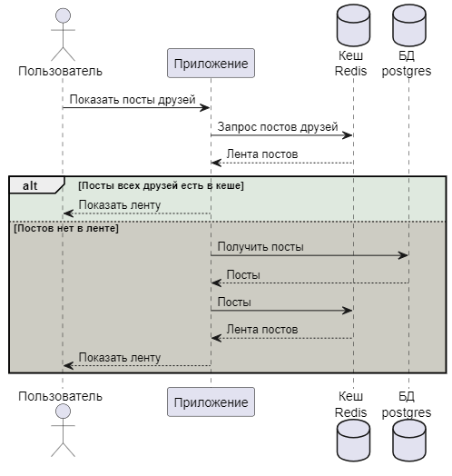
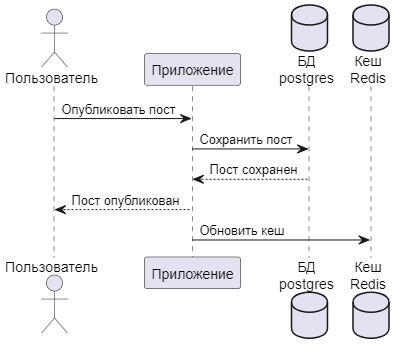

# Домашнее задание №4. Кеширование.

## Условие задания 

1) **Реализовать API (синхронный rest)**

* (опционально) Добавление/удаление друга (методы /friend/add, /friend/delete из спецификации)
* (опционально) CRUD для постов пользователей (методы /post/create, /post/update, /post/delete, /post/get из спецификации)
* Лента постов друзей (метод /post/feed из спецификации)

2) **Разработать структуру БД для хранения постов пользователей**
Наполнить БД тестовыми данными.

ссылка на сгенерированные тексты постов: https://github.com/OtusTeam/highload/blob/master/homework/posts.txt
(опционально, можно сгенерировать самостоятельно)

3) **Реализовать кэширование ленты.**

Требования:

* Лента постов друзей формируется на уровне кешей
* В ленте держать последние 1000 обновлений друзей
* Лента должна кешироваться

Внесены дополнения в [POSTMAN collection](OTUS-HighLoadArch-HW1.postman_collection)

## Реализация API

### Метод добавления и удаления друга

Добавлен метод добавления друга: /friend/set/{user_id}

Добавлен метод удаления друга: /friend/delete/{user_id}

Внесены изменения в коллекцию postman.

### CRUD для постов пользователей

В БД создана новая таблица для постов пользователей - **posts**

Для работы с сопостами добавлены 4 метода в API:
* /post/create
* /post/update
* /post/delete
* /post/get

Внесены дополнения в [POSTMAN collection](OTUS-HighLoadArch-HW1.postman_collection)

### Лента постов друзей

Сделан метод для получения всех постов друзей пользователя:

/post/feed

Внесены дополнения в [POSTMAN collection](OTUS-HighLoadArch-HW1.postman_collection)

## Разработка структуры БД для хранения постов пользователя

### Создание таблицы для хранения постов пользователей

Создана таблица с постами пользователей - posts.


### Наполнение таблицы

Для наполнения написан скрипт на pgsql.

Для генерации постов написана функция, генерирующся случайный текст переменной длины:
```
CREATE OR REPLACE FUNCTION fnc_genpost(usr CHARACTER VARYING(255),num_posts INT)
RETURNS void
LANGUAGE plpgsql AS
$func$
DECLARE 
	text_length INT;
	random_text TEXT;
BEGIN
	FOR j IN 1..num_posts LOOP
		random_text :=  'p ' || j;
		text_length := FLOOR(random() * 500)::INT;
    	FOR k IN 1..text_length LOOP
        	random_text := random_text || chr(FLOOR(random() * 26)::INT + 97);
        END LOOP;
-- в таблицу с постами ставим юзера и сгенерированный пост
        INSERT INTO posts (post_id, author_id, post) 
            VALUES (uuid_generate_v4(), usr,random_text);
        END LOOP;
END;
$func$;
```

Распределение постов сделно экпонентациальным:


На рисунке по вертикали количество постов, по горизонтали id пользователя. У небольшого количества пользоваетей до 1 000 постов. 

Всего постов в БД создалось более 40 млн записей.

## Разработка кеширования ленты постов

### Выбор способа кеширования

Уровни кеширования:
- браузерное;
- proxy;
- кэширование на уровне веб-сервера;
- кэширование на уровне БД

Для кеширования будем использовать redis.



Для получения ленты кешируется лента постов. Ключ - id пользователя, значение - все посты пользователя.

### Выбор способа инвалидации

TTL (time to live) - не подходит, к постам сложно применить время жизни.
Инвалидация по событию - более подходящее под определение. В нашем случае - это создание нового поста (инвалидация по событию изменения или удаления поста не реализована в рамках данного ДЗ).



Т.е. обновление кеша происходит в двух случаях - при создании поста пользователем и при обращении к кешу, если кеш отсустутвует.

todo: не настроено кеширование на изменение поста и на уделение поста

После выполнения здаания стало понятно, что необходимо было дополнитильно добавить время создания поста для корректного вытеснения данных из кеша и при выполнении требования "В ленте держать последние 1000 обновлений друзей".