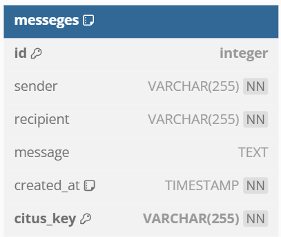
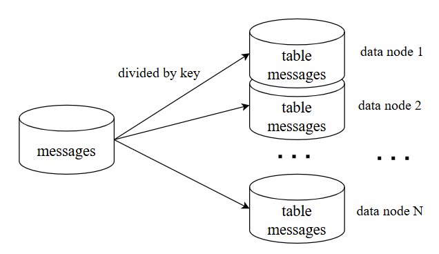
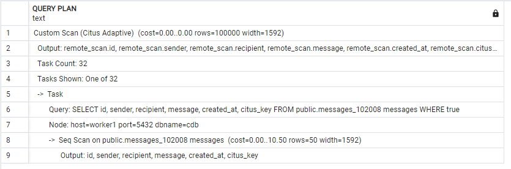
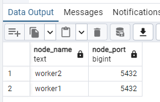
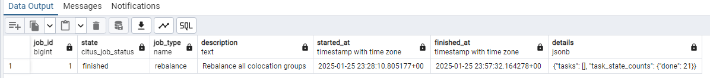

# Домашнее задание №5 - Шардирование


## Структура данных для работы с сообщениями

Создана таблица в БД для работы с сообщениями:



id - уникальный идентификатор строки;
sender - id отправителя сообщения;
recipient - id получателя сообщения;
message - текст сообщения;
created_at - время записи сообщения;
citus_key - параметр по которому затем будет производиться шардирование.

Установлен составной ключ (id, citus_key), т.к. во время работы над заданием стало понятно, что не получится шардировать по citus_key и выдержать уникальность значений id при записи на разные шарды.

## API для работы с сообщениями

Разработан метод POST /dialog/{user_id}/send - для создания сообщения между пользователями.
Для получения сообщений реализовнм метод GET /dialog/{user_id}/list

Внесены дополнения в [POSTMAN collection](OTUS-HighLoadArch-HW1.postman_collection)

## Выбор вида шардинга

Виды шардинга по организации БД:
- Вертикальный;
- Горизонтальный;
- Гибридный.

В нашем случае шардинг нужен для хранения сообщений между пользователям. Необходимо обеспечить высокую скорость доступа к данным, в т.ч. к предыдущим сообщениям. При этом возможно разделить данные так, чтобы они не пересекались для разных пользователей на разных шардах. Возможно сделать хранение и приложение близкое к "мультиарендной" архитектуре. В этом случае целесообразнее выбрать горизонтальное шардирование.



Необходимо предусматривать:
а) равномерность распределения объема, с учетом того, что некоторые пользователи могут писать гораздо больше остальных;
б) возможность проведения решардинга


## Выбор способа деления данных

При шардировании должен быть учтен "эффект Леди Гаги" - несколько пользователей могут писать/получать гораздо больше сообщений, чем другие.

Шардирование будем выполнять по ключу.

Целесообразно сделать шардирование по получателю и отправителю. При этом, если поменять местами отправителя и получателя, то данные должны попасть на тот же шард.

Реализован алгоритм, который получает на вход id отправителя и получателя, сортирует в определенном порядке и создает ключ для шардирования. Это гарантирует равномерное распределение по шардам по такому ключу.


## Инструмент

Для обеспечения горизонтального шардинга на pgsql в docker-compose добавлен Citus.

## Шардинг

Добавим контейнер с координатором (master) и добавим шард (worker1). wal_level установим на 'logical'.

При проверке запроса:
explain SELECT * FROM public.messages;


## Решардинг

При добавлении или удалении шарда исползуем стандартный функционал Citus. Например, добавим еще один шард командой ```SELECT master_add_node('worker2', 5432)```, проверим, что добавился дополнительный шард:


После запустим задачу на ребалансировку: ```SELECT citus_rebalance_start()``` и дождемся завершения:



