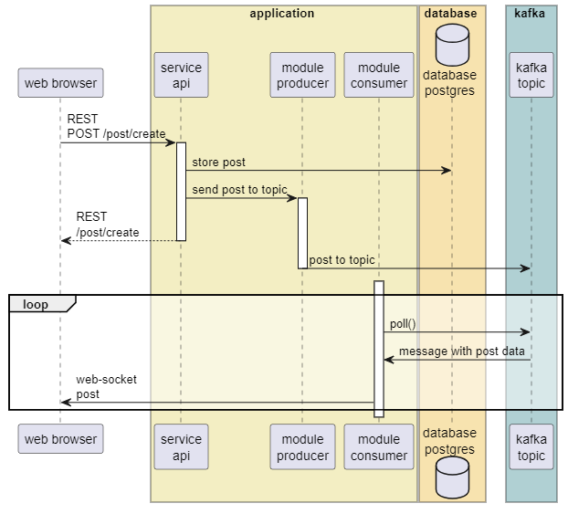
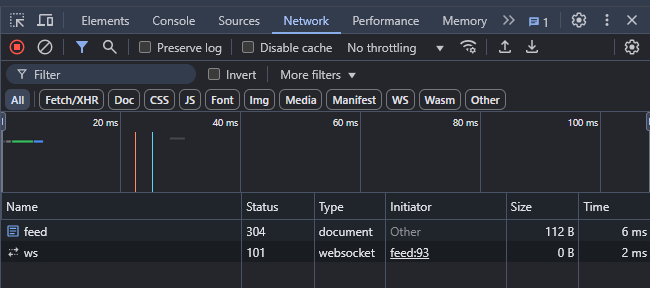
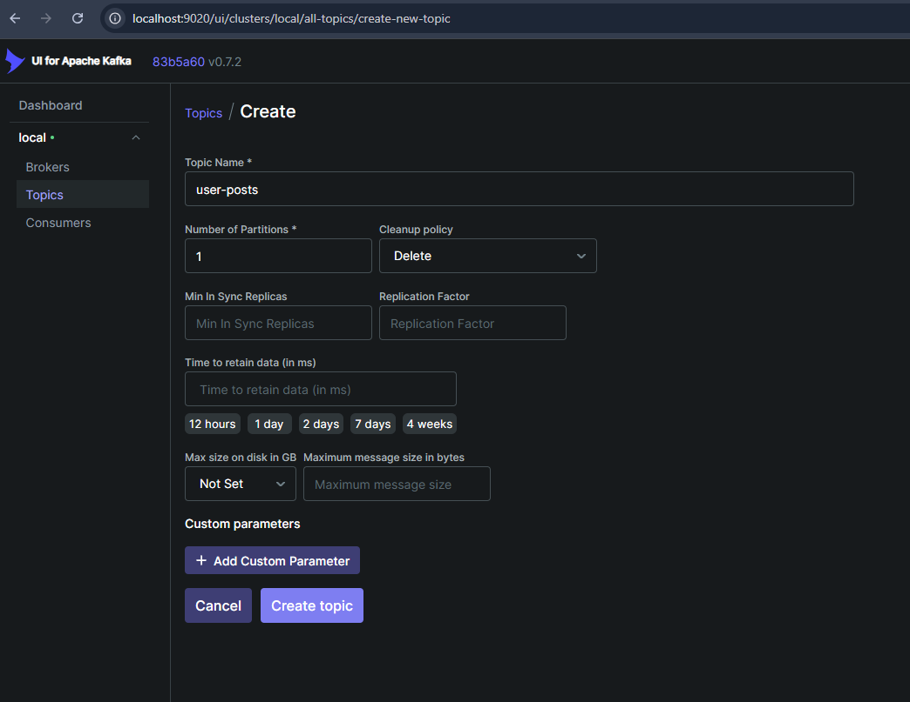
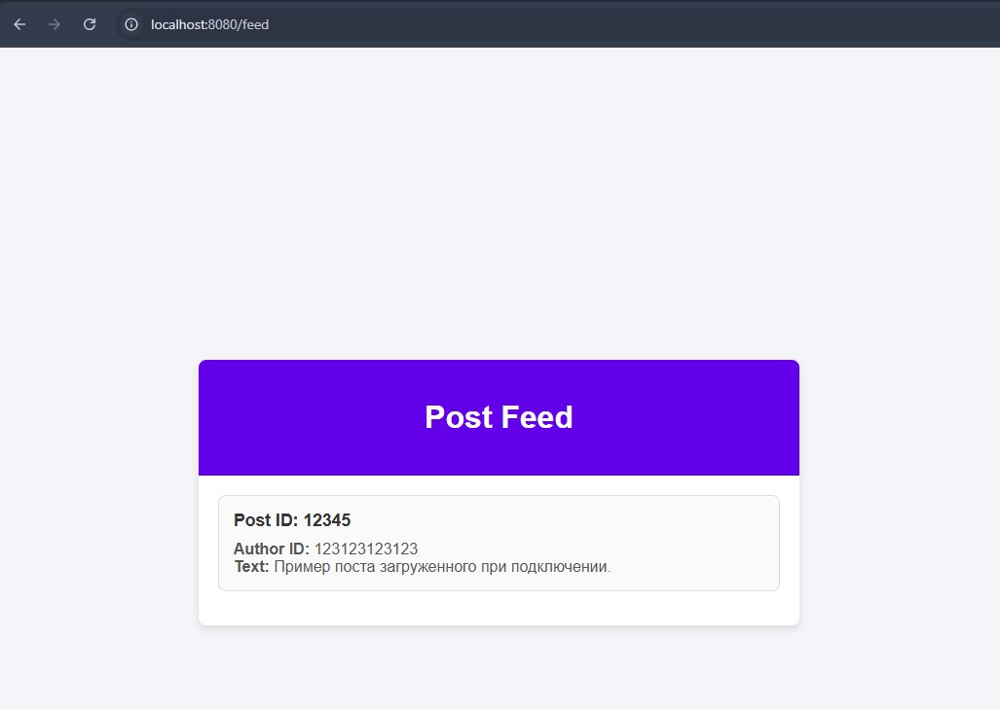
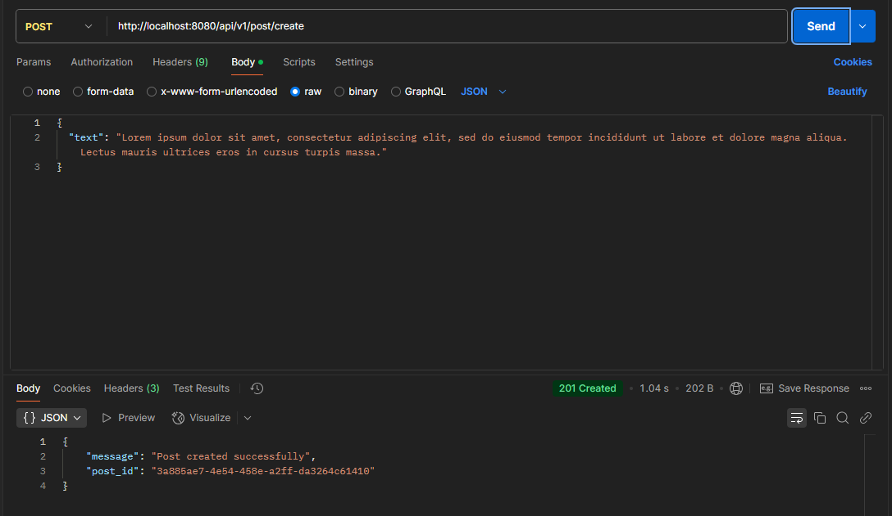
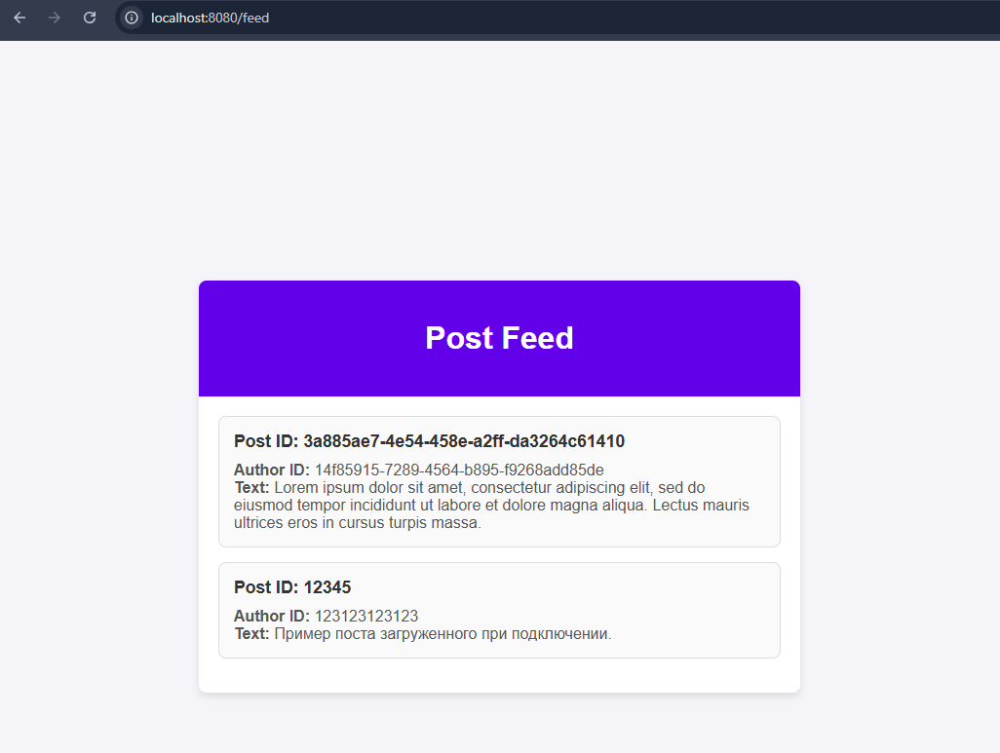
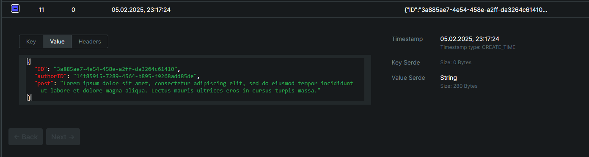

# Домашнее задание №6 - Онлайн обновление ленты новостей

## Разработка отложенного обновления ленты постов

Изобразим диаграмму взаимодействия. В приложении отдельно выделены модули: принимающий и обрабатывающий сообщения с сайта через REST API, модуль отправляющий сообщения в топик kafka и модуль, принимающий сообщения из kafka.

## Обмен сообщениями через web-socket

Настроен роутинг для принятия запросов. Адрес страницы /feed 

Проверим, что при посещении страницы происходит подключение к веб-сокету:

Пользователь заходит на сайт. Предполагается, что при входе пользователь логируется и возможно идентифицировать пользователя (в рамках выполнения ДЗ логин поключенного пользователя зашит непостредственно в коде).

## Реализация отложенной отправки сообщений в ленту

В сборку добавлены контейнеры: zookeeper, kafka1 и kafka-ui. Написаны модули получающие сообщение и отправляющие в топик kafka (producer) и забирающий сообщение из топика (consumer). 

В текущей реализации consumer получает считывает данные из топика, определяет подключенных через web-socket пользователей и отправляет сообщения в ленту подключенным друзьям автора поста.

## Учет "эффекта Леди Гаги"

Для случая, когда один пользователь пишет значительно больше другого возможно использовать несколько партиций в рамках топика. Отправку значений в топик производить с использованием ключа, для популярных пользователей в свои партиции.

## Демо работы сервиса

Зайдем в ui kafka и создадим топик user-posts, для проверки работы с одной партицией

Текущая лента постов у пользователя на сайте:

Отправим пост через postman:

Пост добавился в ленту подключенного к вебсокету пользователя:

Сообщение размещенное в топике:
